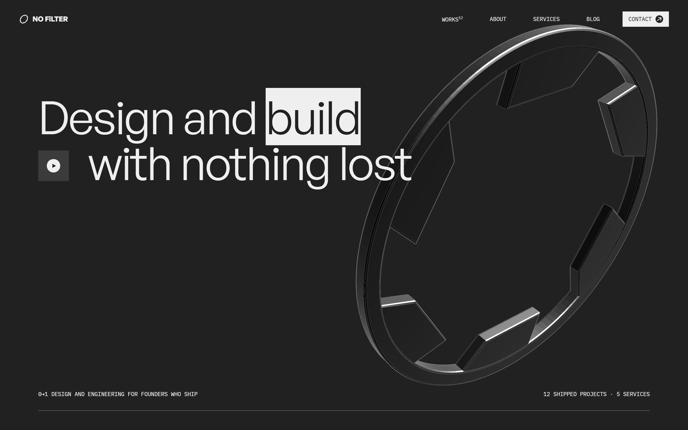
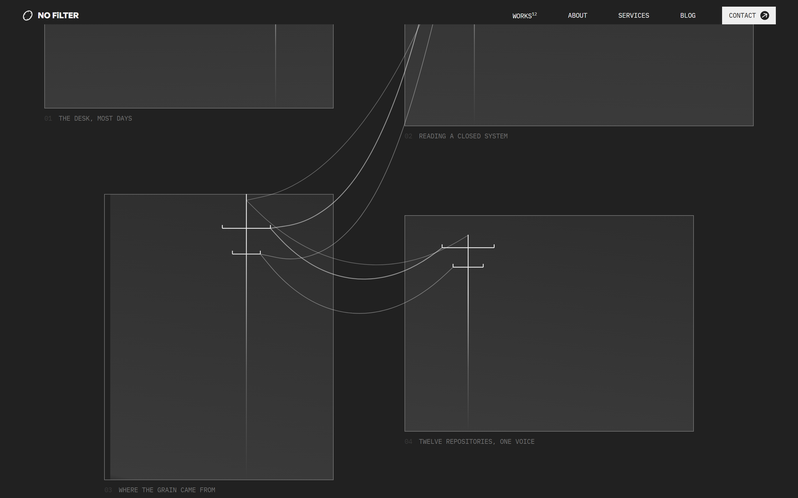
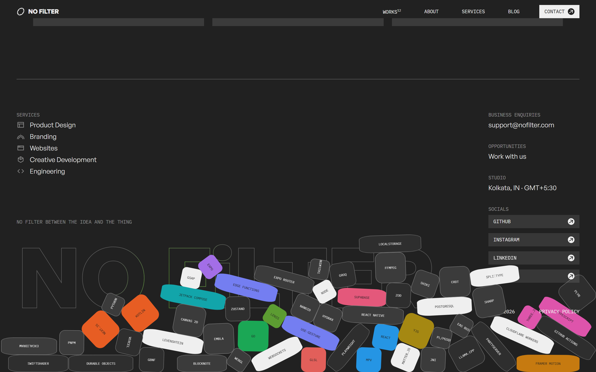
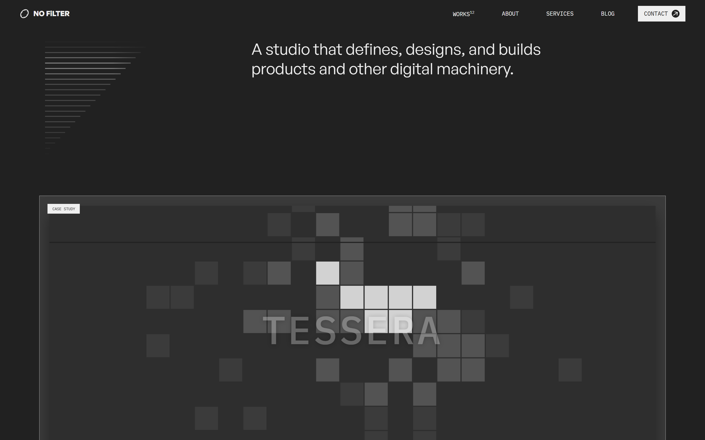
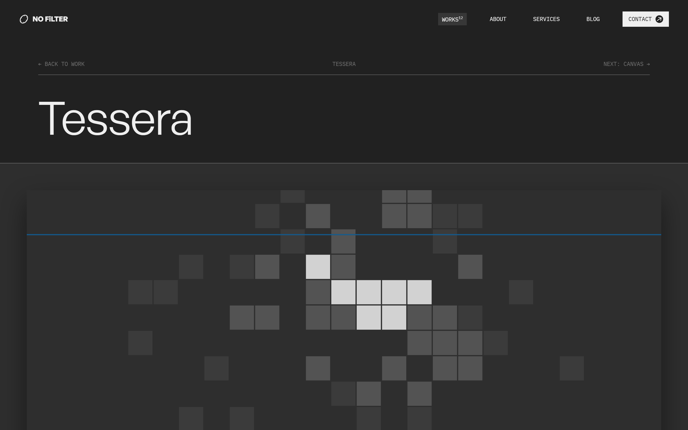
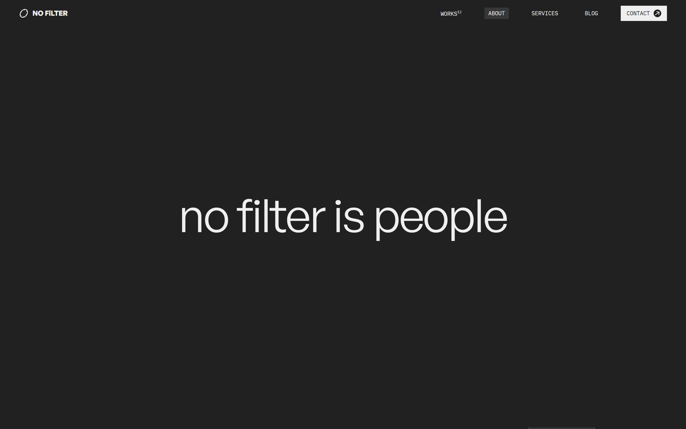
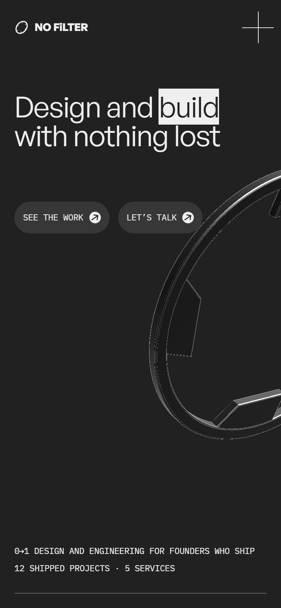

# No Filter

**A studio site for a studio of one.** Design and engineering for founders who ship — twelve real
projects, five services, and a footer you can play with.

Built with Next.js 15, GSAP and Three.js. Dark, typographic, and heavily animated, with every
motion value written down and machine-checked before it lands.

**[n0-filtr.vercel.app →](https://n0-filtr.vercel.app)**



---

## What's in it

| | |
|---|---|
| **12 case studies** | Each one written from its own repository, with a sampled accent pair that themes the whole page |
| **5 services · 5 industries** | Templated pages with their own navigation and FAQ sets |
| **A blog** | MDX-adjacent typed blocks, syntax-highlit with Shiki at build time |
| **A 3D brand mark** | The Open Aperture — a housed iris mechanism in Three.js with a custom GLSL material, which tips and actuates as the pointer crosses it |
| **A block pit** | 56 Matter.js bodies piled over the footer, each labelled with something the work is actually built with. Drag them around |
| **A wire rig** | Simulated ropes strung between the culture frames. Drag a card and they swing, whip and settle |

---

## The parts worth looking at

### The wire rig



Four of the six culture frames grow an electric pole, and wires hang between them — out of one
frame, across the gap, into the next. Every wire is fourteen verlet points with gravity and distance
constraints, pinned at both ends to the crossarm it leaves from.

It started as a Bézier with a hand-tuned sag term, which was fine until the cards became draggable.
A formula has no memory: it resolves to the right shape every frame, with no swing and no settle.
Simulating it deleted both tuned numbers — sag is gravity acting on a rope cut longer than its gap,
and *a stretched wire straightens* is not a rule anyone wrote, it's what happens when segments can't
exceed their rest length.

Grab any card. `lib/motion/rope.ts` · `components/motion/wireRig.ts`

### The block pit



Matter.js, lazy-loaded, running on GSAP's ticker rather than its own runner. Every tile carries a
real dependency name; the coloured ones are drawn from the twelve projects' accents, which is the
only other place on the site those colours appear together.

The wordmark behind it is hollow — outline letters with a second stroked copy masked to a circle at
the pointer, so only the strokes near your cursor take colour. On a case study it lights in that
project's own accent; everywhere else it cycles the twelve.

### The work



Twelve cards on a twelve-column grid with authored placements. Hovering one sends its title
travelling to the corner while an info drawer wipes in behind it. Each card's plate is generated in
code from the site's own vocabulary — there are no stock photographs anywhere on this site.



### The about page



Forty-five artefacts rise out of the fold in a pinned, scrubbed sequence, staggered from random
across a 4×9 grid with a real perspective and an X-rotation. It is the best piece of motion on the
site and it is worth scrolling slowly.

---

## Running it

```bash
npm install
npm run dev          # localhost:3000
```

```bash
npm run build        # production build
npm run verify       # THE GATE — see below
npm run lint
npm run typecheck
```

---

## The verification harness

The unusual part of this repo. Animation work rots quietly: a duration drifts, a setter silently
stops firing, a value gets "tidied" back to something rounder. So the motion is asserted rather than
eyeballed, and `npm run verify` has to pass before anything is called done.

```
tokens   138/138    computed styles vs the token table, at three viewports
motion   276/276    timeline durations, eases, and distances actually travelled
visual   judged     screenshot diffs, reviewed rather than thresholded
budget     7/7      bundle size, route weight, triangle count, Lighthouse
```

```bash
npm run verify:tokens
npm run verify:motion
npm run verify:visual
npm run verify:budget
```

It earns its keep. It has caught an easing curve a full power too strong across the whole site, a
`once: true` that quietly broke the back button, a homepage that came back from a scrolled page with
no ScrollTriggers at all, and — most recently — two scroll parallaxes that had **never once run**,
because `gsap.quickSetter(el, 'yPercent', '%')` silently writes nothing at all. Two hundred and
sixty-seven assertions had been passing the whole time; none of them measured distance travelled.
Nine now do.

---

## How it's built

**Next.js 15** (App Router, TypeScript strict) · **CSS Modules** on a token sheet · **GSAP** +
ScrollTrigger · **Lenis** · **SplitType** · **Three.js** with custom GLSL · **Matter.js** ·
**Embla** · **Shiki** · **Plyr** · deployed on **Vercel**.

No Tailwind, no component library, no animation library beyond GSAP.

A few rules the whole codebase holds to:

- **One animation loop.** GSAP's ticker drives Lenis, ScrollTrigger and Matter. There is no second
  `requestAnimationFrame` anywhere, and `verify:motion` probes for one.
- **Everything is `rem`** on a fluid root, locked at 1440px. Two exceptions: hairlines and the
  footer wordmark.
- **Reverses run faster than forwards** — always. Nothing closes at the speed it opened.
- **The display face is never bolded.** Hierarchy comes from size and colour. The wordmark is the
  one logo-shaped exception.
- **`prefers-reduced-motion` is honoured everywhere**, and it means *reduced*, not *deleted* — a
  light that follows your pointer stays, a colour that changes on its own goes.

---

## Layout

```
app/                 routes — home, works, services, industries, about, blog, privacy
components/          by area: hero, works, case, services, about, blog, chrome, motion,
                     physics, brand, ui, art
lib/                 content model, motion tokens, the rope simulation, helpers
content/works/       the twelve case studies, one file each
docs/build/          how this was built: protocol, phases, decisions, issues, state
docs/spec/           the design system, component and motion specs, page specs
tools/verify/        the harness
```

`docs/build/DECISIONS.md` and `docs/build/ISSUES.md` are the interesting reading — every judgement
call and every bug, with the reasoning that produced it.

---

## On mobile



Every interactive control clears the 44px floor, nothing scrolls sideways at 390, the nav panel is
`inert` while closed, and the effects that need a pointer or side-by-side frames simply don't render
below 992 rather than degrading into something worse.

---

<sub>Built by <a href="https://github.com/Sayandeep1013">Sayandeep</a> · No filter between the idea and the thing</sub>
